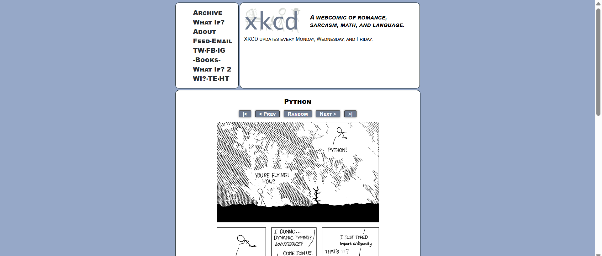
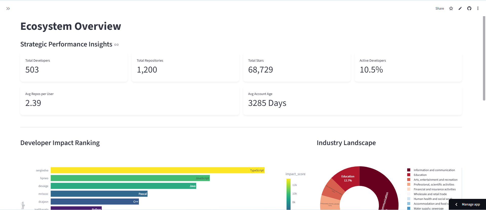
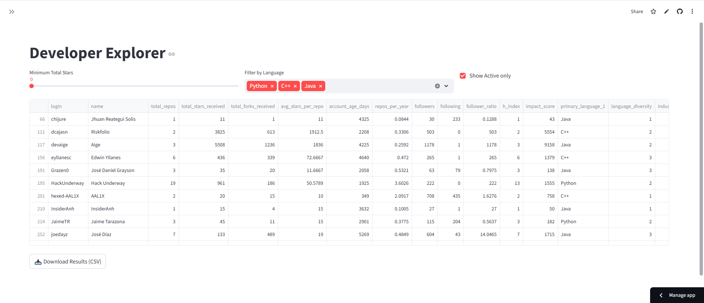
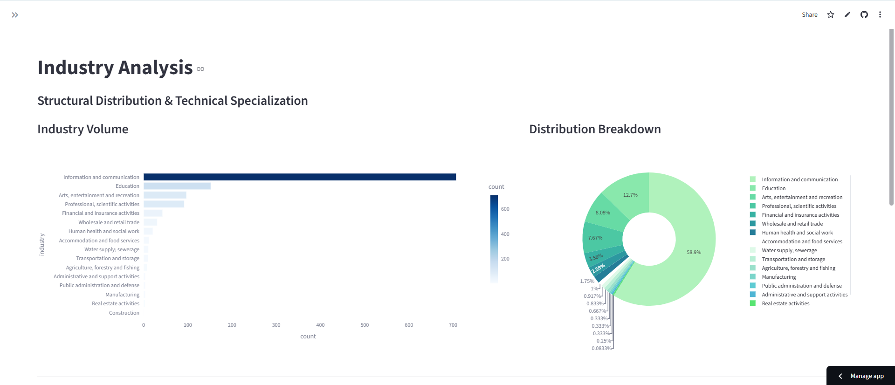

# GitHub Peru Analytics: Developer Ecosystem Dashboard

Analyzing the Peruvian developer landscape through data engineering and AI.

## Section 1: Project Title and Description
**GitHub Peru Analytics** is a comprehensive data engineering and AI project focused on mapping the software development ecosystem in Peru. By leveraging the GitHub API, we analyzed over 500 developers and 1,200 repositories to understand technological trends, industry focus, and community impact.

### Antigravity Easter Egg
Following the Python tradition of exploration:


## Section 2: Key Findings
Based on our analysis of the Peruvian ecosystem:
1. **Language Landscape**: JavaScript (16.4%) and TypeScript (15.5%) dominate the professional landscape.
2. **Industry Focus**: 58% of projects are centered on Information and Communication, with Education (12.6%) as the second most active sector.
3. **Professional Maturity**: The average developer in this dataset has a 9-year-old GitHub account, indicating a mature core community.
4. **Community recognition**: Local projects have amassed over 68,000 stars cumulative.
5. **Geographic Centralization**: Lima remains the primary hub for technical innovation and open-source contribution in the country.

## Section 3: Data Collection
- **Users and Repositories**: 503 unique users and 1,200 active repositories collected.
- **Time Period**: Data reflects the state of the ecosystem as of March 2026.
- **Rate Limiting**: Managed via exponential backoff using the `tenacity` library and a custom `GitHubClient` that monitors X-RateLimit headers to prevent API blocking.

## Section 4: Features
- **Overview Dashboard**: High-level KPIs and ecosystem growth timeline.
- **Developer Explorer**: Advanced filtering of users by 20+ specialized metrics.
- **Repository Browser**: Search and filtering by industry classification and traction.
- **Industry Analysis**: Structural distribution using CIIU standards and Industry-Language heatmaps.
- **Language Analytics**: Deep dive into the technical stack market share.
- **AI Agent Transparency**: Public documentation of the autonomous classification reasoning.

### Page Screenshots





## Section 5: Installation
1. **Clone the repository**:
   ```bash
   git clone https://github.com/estefania-apaza/Github-Peru-Developer-Ecosystem.git
   cd Github-Peru-Developer-Ecosystem
   ```
2. **Install dependencies**:
   ```bash
   pip install -r requirements.txt
   ```
3. **Environment Setup**: Create a `.env` file in the root directory:
   - **GitHub Token**: Generate a Personal Access Token (PAT) at GitHub Settings > Developer Settings.
   - **OpenAI Key**: Obtain an API key from the OpenAI Dashboard.
   ```env
   GITHUB_TOKEN=your_pat_here
   OPENAI_API_KEY=your_key_here
   ```

## Section 6: Usage
1. **Extraction**: Run `python scripts/extract_data.py` to fetch raw user and repo data.
2. **Classification**: Run `python scripts/classify_repos.py` to start the AI Agent processing.
3. **Metrics**: Run `python scripts/calculate_metrics.py` to generate the dashboard JSON/CSV files.
4. **Dashboard**: Launch the UI with `streamlit run app/main.py`.

## Section 7: Metrics Documentation
### User-Level Metrics
- **impact_score**: A weighted composite of stars, followers, and repository count.
- **h_index_repos**: Measures both the productivity and citation impact (stars) of a developer.
- **contribution_consistency**: Percentage of repositories with activity in the last 12 months.
- **account_age_days**: Total duration since the account was created.
- **avg_stars_per_repo**: Mean stars across all public repositories.

### Ecosystem Metrics
- **active_developer_pct**: Ratio of developers with recent pushes to the total sample.
- **language_diversity_index**: Measures the variety of programming languages used across the country.
- **avg_repos_per_user**: Average number of public projects per developer.

## Section 8: AI Agent Documentation
The **Classification Agent** is an autonomous entity built on GPT-4o-mini.
- **Architecture**: Loop-based reasoning using Function Calling.
- **Tools**: `get_readme` (retrieves full documentation for context), `get_languages` (technical breakdown), `classify_industry` (maps to CIIU).
- **Decision Logic**: The agent evaluates metadata and determines if deeper context is required before committing to an industrial category.

## Section 9: Limitations
1. **Location Bias**: Restricted to users with public location metadata set to "Peru" or its major cities.
2. **Classification Defaults**: Generic tooling or library projects may be over-represented in the "Information and Communication" category due to lack of specific business application in metadata.
3. **API Thresholding**: The sample size is limited by GitHub Search API's 1000-result cap per query, though mitigated through city-based stratification.

## Section 10: Author Information
- **Name**: [Your Name]
*   **Course**: Prompt Engineering - Assignment 2
*   **Date**: March 2026
*   **Video Link**: [Found in demo/video_link.md](demo/video_link.md)
